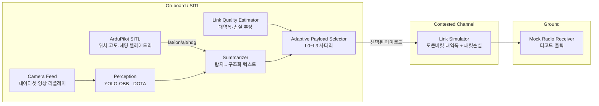

# D4D Track 1 — Onboard AI: Bandwidth-Resilient ISR Summarizer

> **한 줄 요약**
> 위성·이중 데이터링크를 붙여도 링크가 열화되면 완전한 이미지를 못 보낸다.
> → 온보드에서 영상을 **객체 탐지 → 텍스트 요약**으로 압축해, 링크 품질에 따라
> **이미지 → ROI 크롭 → 텍스트 → 카운트**로 단계적 폴백하며 항상 "상황"은 전달한다.
>
> **핵심 데모 한 컷:** 링크 품질을 떨어뜨리면 2.4 MB 이미지 전송이 실패하는 동안,
> 같은 장면이 ~200 byte 텍스트로 무전 수신단에 끊김 없이 도착한다. (≈10,000:1 압축)

전부 오픈소스 / 소프트웨어 SITL로 구동. 실제 무전 송신은 **모사(mock)** 만 한다.

---

## 0. 스코프 (중요)

**In scope**
- ArduPilot SITL 기반 가상 비행 + 텔레메트리(MAVLink)
- 공개 데이터셋(DOTA류) 범용 항공 객체 탐지
- 탐지 결과 → 구조화 텍스트 요약 (템플릿 우선, VLM 캡션은 stretch)
- 링크 품질 시뮬레이터 + 대역폭 적응형 페이로드 사다리
- 지상측 mock 무전 수신/디코더 (텍스트 출력)
- 적/아군 판별, 부대 규모·전력 평가 같은 위협 판단
- 사격/표적 좌표 핸드오프
- 요약은 "객체 종류·개수·대략 위치"까지의 **범용 리포트**로 한정

이렇게 잡아도 심사 포인트(=작동하는 통신 복원력 데모)는 그대로 산다.

---

## 1. 아키텍처



데이터 한 프레임의 흐름:
1. SITL이 현재 자세/위치 텔레메트리를 발행
2. 카메라(=데이터셋/영상)에서 프레임 1장
3. YOLO-OBB로 객체 탐지 (회전 박스 + 클래스 + conf)
4. 탐지 + 텔레메트리 → 요약기로 합류 (프레임에 좌표 태깅)
5. 링크 추정기가 현재 가용 대역폭 판단
6. 셀렉터가 그 예산에 맞는 **가장 높은 레벨** 페이로드 선택
7. 채널 시뮬레이터 통과 → 수신단이 받은 만큼 복원/출력

---

## 2. 모듈 설계

### A. Sim & Telemetry — `sim/`
- ArduPilot SITL(`sim_vehicle.py -v ArduCopter`) 띄우고 `pymavlink`로 텔레메트리 구독
- 미션 웨이포인트 따라 자동 비행, 각 프레임 시각에 `(lat, lon, alt, hdg)` 스냅샷
- SITL은 카메라 렌더가 없으므로 **영상은 별도 소스**(아래 B)로 두고 시각만 동기화

### B. Camera Feed — `perception/source.py`
24시간 안엔 렌더 파이프라인 붙이지 말고 **리플레이**가 정답:
- 옵션1: DOTA/VisDrone 정지영상을 순차 스트림 (가장 안전)
- 옵션2: 드론 항공 영상 mp4를 프레임 단위로 디코드
- 각 프레임에 SITL 텔레메트리를 메타로 attach → 지오태깅 가능

### C. Perception — `perception/detect.py`
- **Ultralytics YOLO (v8/v11) OBB** 모델 — DOTA는 회전 박스라 OBB가 맞음
- DOTA-v1/v1.5 사전학습 가중치로 시작 (직접 학습은 stretch)
- CPU 데모면 추론 느리니: 입력 다운스케일 + 프레임 샘플링(예: 2 fps)
- 출력 스키마:
  ```json
  {"frame_t": 723.4, "dets": [
    {"cls": "vehicle", "conf": 0.81, "obb": [...], "cxcy": [412, 233]},
    {"cls": "ship", "conf": 0.74, "obb": [...], "cxcy": [120, 540]}
  ]}
  ```

### D. Summarizer — `summarizer/`
**템플릿 기반을 코어로** (결정적·빠름·데모에서 안 깨짐):
- 클래스별 카운트 집계 + 화면 사분면/그리드로 대략 위치
- 텔레메트리로 픽셀→지상좌표 근사 (homography 없이도 nadir 가정 + FOV로 러프 추정)
- 출력 예 (구조화 텍스트, ~150–250 B):
  ```
  T=00:12:03 POS=37.4825,127.0398 ALT=120 HDG=090
  DET=[veh:3, ship:1, bldg:2] CONF=0.74 QUAD=NE
  ```
- **stretch:** 소형 VLM 캡션으로 자연어 한 줄 ("북동측에 차량 3대와 소형 선박 1척, 건물 2동 관측")
  - 온보드 로컬이 원칙이지만 데모 한정으로 API 캡션도 가능 (`api.anthropic.com` 허용됨)

### E. Contested-Comms Ladder — `comms/` ★ 핵심
링크 예산에 맞춰 **가장 정보량 많은** 레이어 선택:

| Lvl | 페이로드 | 대략 크기 | 트리거 |
|-----|----------|-----------|--------|
| L0  | 풀 JPEG 프레임 | 1–3 MB | 링크 양호 |
| L1  | 탐지 ROI 크롭 + 저품질 JPEG | 50–200 KB | 대역폭 제한 |
| L2  | 구조화 텍스트 리포트(D) | 150–300 B | 링크 열화 |
| L3  | 카운트만 (`veh:3 ship:1`) | ~30 B | 거의 차단 |

**링크 시뮬레이터** (`comms/channel.py`):
- 토큰버킷으로 가용 대역폭(byte/s) 제한 + 확률적 패킷 손실 주입
- **데모 UI에 슬라이더** 하나: "링크 품질 100%→0%" 내리면 자동으로 L0→L3 강등
- 각 전송마다 `bytes_sent`, `delivered?`, `selected_level` 로깅 → 화면에 실시간 표시

### F. Mock Radio Receiver — `receiver/`
- 채널 반대편에서 받은 페이로드 디코드해 터미널/간단 UI에 출력
- 텍스트 레벨이면 항상 도착, 이미지 레벨이면 링크 나쁠 때 **실패/타임아웃** 표시
- → "이미지는 못 받는데 텍스트 상황보고는 계속 들어온다"가 눈에 보이게

---

## 3. 받은 zip 매핑 (압축 풀고 내용 먼저 확인할 것)

| 파일 | 추정 용도 | 비고 |
|------|-----------|------|
| `1_onboard_ai_S8.zip` | 온보드 AI 베이스/스캐폴드 | 레포 기반으로 |
| `2_rag_db_data.zip` | RAG DB | **stretch**: 리포트 용어 정규화/표준화 |
| `3_rawdata_uav_attack_dataset.zip` | UAV 데이터셋 | 내용 확인 후 탐지 학습/평가용만 |
| `4_rawdata_uav_networkcommunication.zip` | 통신 트레이스 | 링크 열화 패턴을 **현실적으로** 재현하는 입력 |
| `5_rawdata_aissou_gps_spoofing.zip` | GPS 스푸핑 데이터 | (옵션) GPS-denied 강건성 곁가지 |
| `6_rawdata_misc.zip` | 기타 | 확인 필요 |

`4번`은 채널 시뮬레이터를 "그럴듯한 실측 손실 패턴"으로 만들 수 있어서 데모 설득력에 직접 기여함.

---

## 4. 레포 구조

```
d4d-onboard-ai/
├── sim/            # SITL 런처 + pymavlink 텔레메트리 브리지
├── perception/     # source.py(프레임) + detect.py(YOLO-OBB)
├── summarizer/     # 탐지→텍스트(템플릿) + vlm.py(stretch)
├── comms/          # channel.py(링크sim) + ladder.py(L0~L3) + codec
├── receiver/       # 지상 디코더/출력
├── data/           # 압축 푼 zip들
├── run_demo.py     # 오케스트레이터(슬라이더 포함)
└── handoff.md      # 이 문서
```

## 5. 기술 스택
- Python 3.11, `ultralytics`, `opencv-python`, `pymavlink`, ArduPilot SITL
- 채널/UI: `asyncio` + 간단한 `streamlit` 또는 터미널 대시보드
- (stretch) RAG: 기존 `2_rag_db_data`, VLM 캡션

---

## 6. 24시간 타임라인 (토 09:00 → 일 11:00 제출)

| 구간 | 목표 |
|------|------|
| H0–2 | 환경셋업·zip 해제·SITL 기동·YOLO 사전학습 샘플 추론 성공 |
| H2–6 | 퍼셉션 안정화 (프레임 소스 + 탐지 오버레이) |
| H6–10 | 요약 템플릿 + 페이로드 사다리 골격 |
| H10–14 (야간) | 링크 시뮬레이터 + 적응 선택 + mock 수신단 **E2E 연결** |
| H14–18 | 오케스트레이터 통합 · 지오태깅 · 데모 UI |
| H18–22 | 대역폭 메트릭 오버레이 · 폴백 견고화 · 드라이런 |
| H22–26 | 버퍼 + 데모 리허설 |

**우선순위 원칙:** E(통신 사다리)와 F(수신단)가 데모의 심장.
퍼셉션이 막히면 사전학습 가중치/정지영상으로 우회하고 통신 데모부터 살린다.

---

## 7. 데모 시나리오 (No PPT, 라이브)

1. SITL 자동비행 시작 → 텔레메트리 흐르는 거 보여줌
2. 카메라 피드에 탐지 박스 실시간 오버레이
3. 수신단 터미널: 처음엔 풀 이미지가 잘 도착 (L0)
4. **링크 슬라이더를 내린다** → 시스템이 L1→L2로 자동 강등
5. 이미지 전송은 실패/지연되는데, 텍스트 상황보고는 계속 도착
6. 화면 숫자로 임팩트: `2.4 MB → 0 (실패)` vs `텍스트 198 B → 도착 ✓`

**한 줄 피치:** "링크가 죽어도 상황 인식은 안 죽는다."

---

## 8. 리스크 & 폴백
- YOLO CPU 추론 느림 → 입력 축소·프레임 샘플링, 최악엔 미리 추론한 결과 캐시 재생
- SITL 카메라 없음 → 데이터셋 리플레이로 분리 (이미 설계에 반영)
- 시간 부족 → VLM/RAG/지오태깅은 전부 stretch, 코어(템플릿+사다리)만으로 데모 성립
- 라이브 데모 불안 → 녹화 백업 한 벌 떠두기
